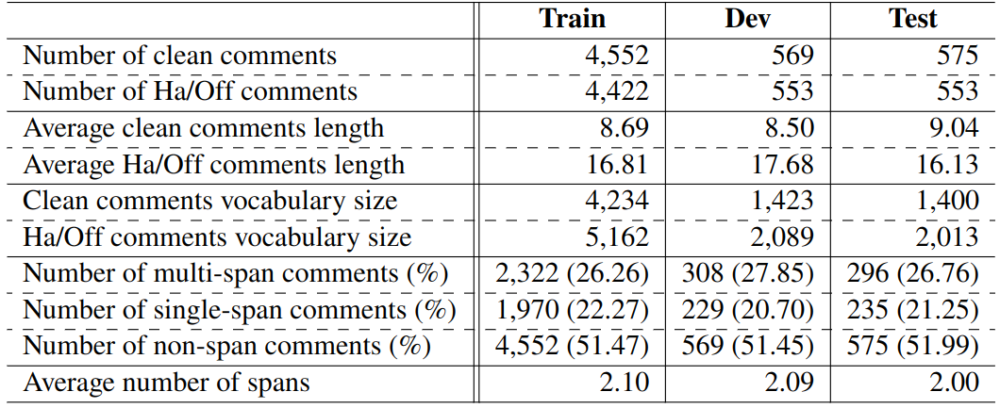
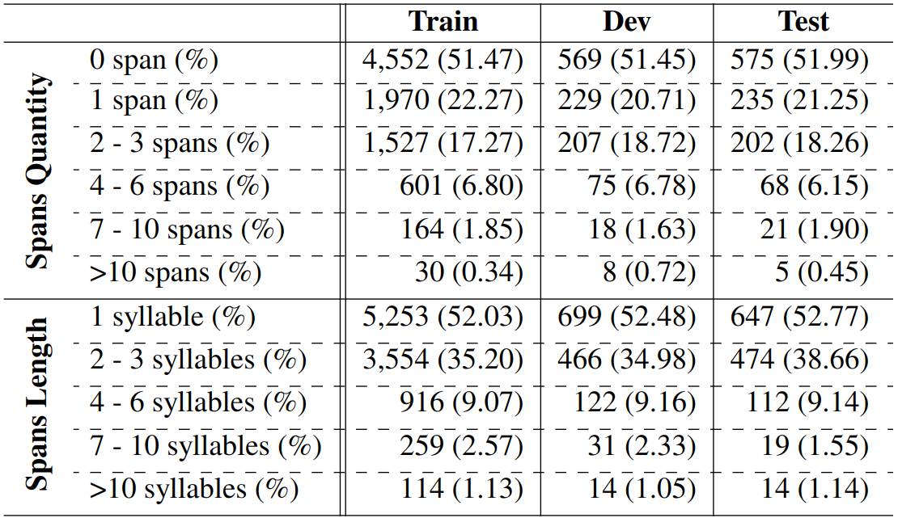
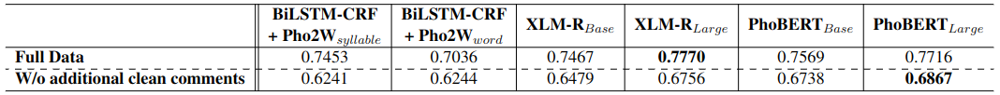

# ViHOS: Vietnamese Hate and Offensive Spans Detection
This repository contains official implementation of the paper [*ViHOS: Vietnamese Hate and Offensive Spans Detection*]() accepted at the [EACL 2023](https://2023.eacl.org/) Main Conference.

## Introduction


The rise in hateful and offensive language directed at other users is one of the adverse side effects of the increased use of social networking platforms. This could make it difficult for human moderators to review tagged comments filtered by classification systems.

To help address this issue, we present the ViHOS (**Vi**etnamese **H**ate and **O**ffensive **S**pans) dataset, the first human-annotated corpus containing 26k spans on 11k online comments.

Our goal is to create a dataset that contains comprehensive hate and offensive thoughts, meanings, or opinions within the comments rather than just a lexicon of hate and offensive terms.

We also provide definitions of hateful and offensive spans in Vietnamese comments as well as detailed annotation guidelines. Futhermore, our solutions to deal with *nine different online foul linguistic phenomena* are also provided in the [*paper*]() (e.g. Teencodes; Metaphors, metonymies; Hyponyms; Puns...).

We hope that this dataset will be useful for researchers and practitioners in the field of hate speech detection in general and hate spans detection in particular.


## Dataset
ViHOS contains 26,476 human-annotated spans on 11,056 comments (5,360 comments have hate and offensive spans, and 5,696 comments do not)

It is splitted into train, dev, and test set with following information:
1. Train set: 8,844 comments
2. Dev set: 1,106 comments
3. Test set: 1,106 comments

ViHOS has two versions:
1. Sequence labeling-based version. There are two sub-folders: 
     * syllable (created by tokenizing texts by VnCoreNLP for PhoBERT model).
     * word (created by splitting texts by space for the other models).
2. Span Extraction-based version.

## Dataset statistics

*Table 1. ViHOS statistics. Vocabularies size and comments length are calculated at the syllable level. In which, Ha/Off? stands for a hate (Ha) or offensive (Off).*


*Table 2. Spans quantity and length statistics.*

**NOTE**: Our dataset has equal number of span and non-span (clean) comments because:
1. We aim to detect the hate and offensive spans directly in online comments
2. With an equal number of span and non-span comments helps models not be biased towards any type.


## Baselines' performances

*Table 3. Experimental results on Full Data versus Without additional clean comments.*

## Citation
If you use our dataset, codes or analyses, please cite our paper:
```
```